# Docs Graph — 108 Ting Ecosystem (control-doc spine)

> Visual map of the **control-document spine**: the root governance docs plus the
> 6-document standard (**H**=HANDOFF.md · **C**=CLAUDE.md · **A**=docs/ARCHITECTURE.md ·
> **M**=docs/MILESTONES.md · **D**=docs/DO_NOT_TOUCH.md · **ai**=.ai_context/) across every repo.
> Companion to [`CONTROL_DOC_COVERAGE.md`](CONTROL_DOC_COVERAGE.md) (the living checklist) and
> [`ARCHITECTURE.md`](ARCHITECTURE.md) (the platform map).
> Surveyed live on the **Mac Studio** checkouts: **2026-07-25** (`git pull --ff-only` first, then
> scan). ⚠️ Coverage reflects the **currently checked-out branch** per repo — several sit on feature
> branches or had local edits (see "Survey caveats" below), so a few rows may differ from
> `origin/main`. Previous survey: 2026-07-02.

## Coverage at a glance

- Overall control-doc coverage: **58 / 174 (≈33%)** across **29 repos** / **9 platforms**.
- Fully compliant (6/6): **only `pos108-core`** (the active work area) — unchanged since the last survey.
- Weakest standards ecosystem-wide: **MILESTONES 1/29** · **DO_NOT_TOUCH 3/29** · **ARCHITECTURE 7/29**.
- Strongest: **HANDOFF 20/29** · **.ai_context 18/29**.
- **Since 2026-07-02:** the `pos108` monorepo was split into per-repo checkouts under `~/108-POS`
  (`core` / `admin` / `terminal` / `orders` / `store` + `slot-api` / `slot-front`); Platform-Services
  gained **Loyalty** and **Payroll** (5 → 7 repos), taking the total 27 → 29. Doc gains:
  **Media** 1/6 → 3/6 (added CLAUDE + ARCHITECTURE), **Identity** 1/6 → 2/6 (added CLAUDE).
  `Payment-Platform/Gateway-scb-soft` is a **non-git working copy** (no `.git`) → excluded from the count.
  `customer-plat` + `platform-console` remain **local-only / un-pushed** (see the ⚠️ note in
  [`ACTIVE_WORK.md`](ACTIVE_WORK.md)); do not treat them as sanctioned scope.

## Graph

```mermaid
graph TD
  ECO["108 Ting Ecosystem — governance spine (root)<br/>HANDOFF · CLAUDE · ENGINEERING_CONSTITUTION · ACTIVE_WORK<br/>ARCHITECTURE · DO_NOT_TOUCH · CONTROL_DOC_COVERAGE · DEPLOYMENT_STANDARD_K3S"]:::root

  ECO --> COM[Commerce-Platform]
  ECO --> BIP[BipByte-Platform]
  ECO --> PS[Platform-Services]
  ECO --> IOT[IoT-Platform]
  ECO --> PAY[Payment-Platform]
  ECO --> AZ[AccountZing-Platform]
  ECO --> DP[Data-Platform]
  ECO --> CR[Creator-Platform]
  ECO --> LOG[Logistics-Platform]

  COM --> COM1["pos108-core · 6/6"]:::full
  COM --> COM2["pos108-admin · 3/6"]:::partial
  COM --> COM3["pos108-terminal · 1/6"]:::partial
  COM --> COM4["pos108-orders · 0/6"]:::empty
  COM --> COM5["pos108-store · 1/6"]:::partial
  COM --> COM6["slot-api · 1/6"]:::partial
  COM --> COM7["slot-front · 1/6"]:::partial
  COM --> COM8["product-vision · 3/6"]:::partial
  COM --> COM9["shop108 · 0/6"]:::empty

  BIP --> BIP1["server · 4/6"]:::partial
  BIP --> BIP2["engines · 3/6"]:::partial
  BIP --> BIP3["realtime-edge · 1/6"]:::partial
  BIP --> BIP4["apps/admin-web · 2/6"]:::partial
  BIP --> BIP5["apps/web · 1/6"]:::partial
  BIP --> BIP6["apps/flutter-app · 1/6"]:::partial

  PS --> PS1["Security/identity · 2/6"]:::partial
  PS --> PS2["Notification · 3/6"]:::partial
  PS --> PS3["Media · 3/6"]:::partial
  PS --> PS4["Loyalty · 2/6"]:::partial
  PS --> PS5["Payroll · 1/6"]:::partial
  PS --> PS6["customer-plat · 1/6 (local-only, un-pushed)"]:::empty
  PS --> PS7["platform-console · 1/6 (local-only, un-pushed)"]:::empty

  IOT --> IOT1["Smart-Farm · 3/6"]:::partial
  IOT --> IOT2["Smart-Home · 2/6"]:::partial

  PAY --> PAY1["Gateway · 3/6"]:::partial
  AZ  --> AZ1["(repo root) · 2/6"]:::partial
  DP  --> DP1["(repo root) · 1/6"]:::partial
  CR  --> CR1["creator · 3/6"]:::partial
  LOG --> LOG1["delivery · 3/6"]:::partial

  classDef root fill:#E1F5EE,stroke:#0F6E56,color:#04342C;
  classDef full fill:#EAF3DE,stroke:#3B6D11,color:#173404;
  classDef partial fill:#FAEEDA,stroke:#854F0B,color:#412402;
  classDef empty fill:#FCEBEB,stroke:#A32D2D,color:#501313;
```



Legend: green = complete (6/6) · amber = partial · red = empty (0/6).

## Coverage matrix (✓ = present · · = missing)

| platform | repo | H | C | A | M | D | ai | n/6 |
|---|---|:-:|:-:|:-:|:-:|:-:|:-:|:-:|
| Commerce-Platform | pos108-core | ✓ | ✓ | ✓ | ✓ | ✓ | ✓ | **6** |
| Commerce-Platform | pos108-admin | ✓ | ✓ | · | · | · | ✓ | 3 |
| Commerce-Platform | pos108-terminal | ✓ | · | · | · | · | · | 1 |
| Commerce-Platform | pos108-orders | · | · | · | · | · | · | 0 |
| Commerce-Platform | pos108-store | ✓ | · | · | · | · | · | 1 |
| Commerce-Platform | slot-api | ✓ | · | · | · | · | · | 1 |
| Commerce-Platform | slot-front | ✓ | · | · | · | · | · | 1 |
| Commerce-Platform | product-vision | ✓ | ✓ | · | · | · | ✓ | 3 |
| Commerce-Platform | shop108 | · | · | · | · | · | · | 0 |
| BipByte-Platform | server | ✓ | ✓ | ✓ | · | · | ✓ | 4 |
| BipByte-Platform | engines | ✓ | ✓ | · | · | · | ✓ | 3 |
| BipByte-Platform | realtime-edge | ✓ | · | · | · | · | · | 1 |
| BipByte-Platform | apps/admin-web | · | ✓ | · | · | · | ✓ | 2 |
| BipByte-Platform | apps/web | · | · | · | · | · | ✓ | 1 |
| BipByte-Platform | apps/flutter-app | · | · | · | · | · | ✓ | 1 |
| Platform-Services | Security/identity | ✓ | ✓ | · | · | · | · | 2 |
| Platform-Services | Notification | ✓ | · | ✓ | · | · | ✓ | 3 |
| Platform-Services | Media | ✓ | ✓ | ✓ | · | · | · | 3 |
| Platform-Services | Loyalty | · | ✓ | · | · | · | ✓ | 2 |
| Platform-Services | Payroll | · | · | · | · | · | ✓ | 1 |
| Platform-Services | customer-plat *(local-only, un-pushed)* | · | · | · | · | · | ✓ | 1 |
| Platform-Services | platform-console *(local-only, un-pushed)* | ✓ | · | · | · | · | · | 1 |
| IoT-Platform | Smart-Farm | ✓ | · | ✓ | · | · | ✓ | 3 |
| IoT-Platform | Smart-Home | ✓ | · | · | · | · | ✓ | 2 |
| Payment-Platform | Gateway | ✓ | · | · | · | ✓ | ✓ | 3 |
| AccountZing-Platform | (repo root) | · | · | · | · | ✓ | ✓ | 2 |
| Data-Platform | (repo root) | ✓ | · | · | · | · | · | 1 |
| Creator-Platform | creator | ✓ | · | ✓ | · | · | ✓ | 3 |
| Logistics-Platform | delivery | ✓ | · | ✓ | · | · | ✓ | 3 |
| **per-doc total** | **(/29)** | **20** | **9** | **7** | **1** | **3** | **18** | **58** |

## Survey caveats (2026-07-25)

- **Surveyed on the Mac Studio**, checking each repo's currently checked-out branch. Repos updated
  cleanly (`git pull --ff-only`): admin, slot-api, slot-front, product-vision, shop108, BipByte
  server/engines/realtime-edge/apps-admin-web/apps-web, Identity, Media, Loyalty, Payroll, Data,
  creator, delivery.
- **Not fast-forwardable** (diverged from origin — reflects the local branch, not `origin/main`):
  pos108-store, customer-plat, platform-console.
- **Left dirty / not pulled** (local uncommitted changes, so the scan reflects the working tree):
  pos108-core, pos108-terminal, pos108-orders, BipByte apps/flutter-app, Notification, Smart-Farm,
  Smart-Home, Payment Gateway, AccountZing.
- On **feature branches** at survey time (not their default branch): engines, apps/admin-web,
  apps/web, apps/flutter-app, Smart-Home, AccountZing, pos108-orders. Doc presence rarely differs
  across branches, but re-survey on `main` if a row looks off.
- `Payment-Platform/Gateway-scb-soft` has **no `.git`** (a soft working copy) → not counted as a repo.

## How to refresh

This matrix is surveyed by checking, per repo, for `HANDOFF.md`, `CLAUDE.md`,
`docs/ARCHITECTURE.md`, `docs/MILESTONES.md`, `docs/DO_NOT_TOUCH.md`, and the `.ai_context/`
directory. Re-run on the **Mac Studio** (`ssh macstudio-ts`, where all checkouts live) and update
both this file and [`CONTROL_DOC_COVERAGE.md`](CONTROL_DOC_COVERAGE.md):

```sh
repos=(
  ~/108-POS/core ~/108-POS/admin ~/108-POS/terminal ~/108-POS/orders ~/108-POS/store \
  ~/108-POS/slot-api ~/108-POS/slot-front \
  ~/108-Ting-Ecosystem/Commerce-Platform/product-vision \
  ~/108-Ting-Ecosystem/Commerce-Platform/shop108 \
  ~/108-Ting-Ecosystem/BipByte-Platform/server ~/108-Ting-Ecosystem/BipByte-Platform/engines \
  ~/108-Ting-Ecosystem/BipByte-Platform/realtime-edge \
  ~/108-Ting-Ecosystem/BipByte-Platform/apps/admin-web \
  ~/108-Ting-Ecosystem/BipByte-Platform/apps/web \
  ~/108-Ting-Ecosystem/BipByte-Platform/apps/flutter-app \
  ~/108-Ting-Ecosystem/Platform-Services/Security/identity \
  ~/108-Ting-Ecosystem/Platform-Services/Notification \
  ~/108-Ting-Ecosystem/Platform-Services/Media \
  ~/108-Ting-Ecosystem/Platform-Services/Loyalty \
  ~/108-Ting-Ecosystem/Platform-Services/Payroll \
  ~/108-Ting-Ecosystem/Platform-Services/customer-plat \
  ~/108-Ting-Ecosystem/Platform-Services/platform-console \
  ~/108-Ting-Ecosystem/IoT-Platform/Smart-Farm ~/108-Ting-Ecosystem/IoT-Platform/Smart-Home \
  ~/108-Ting-Ecosystem/Payment-Platform/Gateway \
  ~/108-Ting-Ecosystem/AccountZing-Platform ~/108-Ting-Ecosystem/Data-Platform \
  ~/108-Ting-Ecosystem/Creator-Platform/creator ~/108-Ting-Ecosystem/Logistics-Platform/delivery
)
for r in $repos; do
  [ -d "$r/.git" ] || { printf "%-52s NO-GIT\n" "$r"; continue; }
  H=.;C=.;A=.;M=.;D=.;ai=.
  [ -f "$r/HANDOFF.md" ] && H=x;            [ -f "$r/CLAUDE.md" ] && C=x
  [ -f "$r/docs/ARCHITECTURE.md" ] && A=x;  [ -f "$r/docs/MILESTONES.md" ] && M=x
  [ -f "$r/docs/DO_NOT_TOUCH.md" ] && D=x;  [ -d "$r/.ai_context" ] && ai=x
  printf "%-52s %s %s %s %s %s %s\n" "$r" "$H" "$C" "$A" "$M" "$D" "$ai"
done
```
