# Docs Graph — 108 Ting Ecosystem (control-doc spine)

> Visual map of the **control-document spine**: the root governance docs plus the
> 6-document standard (**H**=HANDOFF.md · **C**=CLAUDE.md · **A**=docs/ARCHITECTURE.md ·
> **M**=docs/MILESTONES.md · **D**=docs/DO_NOT_TOUCH.md · **ai**=.ai_context/) across every repo.
> Companion to [`CONTROL_DOC_COVERAGE.md`](CONTROL_DOC_COVERAGE.md) (the living checklist) and
> [`ARCHITECTURE.md`](ARCHITECTURE.md) (the platform map).
> Surveyed live on the **Mac Studio** checkouts: **2026-07-25** (`git pull --ff-only` first, then
> scan); `108-platform-services` checked via the GitHub API (no local checkout). ⚠️ Coverage reflects the
> **currently checked-out branch** per repo — several sit on feature branches or had local edits
> (see "Survey caveats" below), so a few rows may differ from `origin/main`. Previous survey: 2026-07-02.

## Coverage at a glance

- Overall control-doc coverage: **75 / 156 (≈48%)** across **26 repos** (9 platform groups + the
  `108-platform-services` monorepo).
- Fully compliant (6/6): **`pos108-core`**, **`108-platform-services`** (ARCHITECTURE/MILESTONES/
  DO_NOT_TOUCH/.ai_context completed in one PR, #21), and, as of 2026-07-25, **`AccountZing-Platform`**
  (root `HANDOFF.md` added #34, on top of ARCHITECTURE + MILESTONES #33 and its pre-existing
  finance-specific `docs/DO_NOT_TOUCH.md` + CLAUDE.md) — three fully-compliant repos.
- **CLAUDE.md rollout (2026-07-25):** CLAUDE.md was added to every repo that was missing it (the
  ecosystem `CLAUDE.template.md` resolved per repo — real build/test commands + guardrails), so
  **CLAUDE coverage jumped 8/26 → 24/26** — every repo now has one except the skipped `shop108`
  (personal fork) and the local-only `platform-console`.
- Weakest standards ecosystem-wide: **MILESTONES 3/26** · **DO_NOT_TOUCH 4/26** · **ARCHITECTURE 8/26**.
- Strongest: **CLAUDE 24/26** · **HANDOFF 20/26** · **.ai_context 16/26**.
- **Backend consolidation (2026-07):** `identity`, `customer`, `loyalty`, `notify`, `secrets` are now
  `services/*` in the **`108-platform-services` monorepo** (one repo, now **6/6** — HANDOFF #19 +
  ARCHITECTURE/MILESTONES/DO_NOT_TOUCH/.ai_context #21 completed the spine); their old standalone
  repos (`Identity-/Customer-/Loyalty-/Notification-/Secrets-Platform`) were **archived 2026-07-24**
  and are dropped from this matrix, along with the superseded local-only `customer-plat`.
  **`pos108-core` stays a separate repo** (a Wave-3 fold-in was reverted, 108-platform-services #15).
  `shop108` (personal fork) was **skipped** by the CLAUDE.md rollout.
- `Payment-Platform/Gateway-scb-soft` is a **non-git working copy** (no `.git`) → excluded.
  `platform-console` remains **local-only / un-pushed** (see the ⚠️ note in
  [`ACTIVE_WORK.md`](ACTIVE_WORK.md)); do not treat it as sanctioned scope.

## Graph

```mermaid
graph TD
  ECO["108 Ting Ecosystem — governance spine (root)<br/>HANDOFF · CLAUDE · ENGINEERING_CONSTITUTION · ACTIVE_WORK<br/>ARCHITECTURE · DO_NOT_TOUCH · CONTROL_DOC_COVERAGE · DEPLOYMENT_STANDARD_K3S"]:::root

  ECO --> COM[Commerce-Platform]
  ECO --> BE[108-platform-services monorepo]
  ECO --> BIP[BipByte-Platform]
  ECO --> PS[Platform-Services]
  ECO --> IOT[IoT-Platform]
  ECO --> PAY[Payment-Platform]
  ECO --> AZ[AccountZing-Platform]
  ECO --> DP[Data-Platform]
  ECO --> CR[Creator-Platform]
  ECO --> LOG[Logistics-Platform]

  BE --> BE1["(one repo) · 6/6<br/>identity · customer · loyalty · notify · secrets"]:::full

  COM --> COM1["pos108-core · 6/6"]:::full
  COM --> COM2["pos108-admin · 3/6"]:::partial
  COM --> COM3["pos108-terminal · 2/6"]:::partial
  COM --> COM4["pos108-orders · 1/6"]:::partial
  COM --> COM5["pos108-store · 2/6"]:::partial
  COM --> COM6["slot-api · 2/6"]:::partial
  COM --> COM7["slot-front · 2/6"]:::partial
  COM --> COM8["product-vision · 3/6"]:::partial
  COM --> COM9["shop108 · 0/6 (skipped — fork)"]:::empty

  BIP --> BIP1["server · 4/6"]:::partial
  BIP --> BIP2["engines · 3/6"]:::partial
  BIP --> BIP3["realtime-edge · 2/6"]:::partial
  BIP --> BIP4["apps/admin-web · 2/6"]:::partial
  BIP --> BIP5["apps/web · 2/6"]:::partial
  BIP --> BIP6["apps/flutter-app · 2/6"]:::partial

  PS --> PS1["Media · 3/6"]:::partial
  PS --> PS2["Payroll · 2/6"]:::partial
  PS --> PS3["platform-console · 1/6 (local-only, un-pushed)"]:::empty

  IOT --> IOT1["Smart-Farm · 4/6"]:::partial
  IOT --> IOT2["Smart-Home · 3/6"]:::partial

  PAY --> PAY1["Gateway · 4/6"]:::partial
  AZ  --> AZ1["(repo root) · 6/6"]:::full
  DP  --> DP1["(repo root) · 2/6"]:::partial
  CR  --> CR1["creator · 4/6"]:::partial
  LOG --> LOG1["delivery · 4/6"]:::partial

  classDef root fill:#E1F5EE,stroke:#0F6E56,color:#04342C;
  classDef full fill:#EAF3DE,stroke:#3B6D11,color:#173404;
  classDef partial fill:#FAEEDA,stroke:#854F0B,color:#412402;
  classDef empty fill:#FCEBEB,stroke:#A32D2D,color:#501313;
```



Legend: green = complete (6/6) · amber = partial · red = empty (0/6).

## Coverage matrix (✓ = present · · = missing)

| platform | repo | H | C | A | M | D | ai | n/6 |
|---|---|:-:|:-:|:-:|:-:|:-:|:-:|:-:|
| Commerce-Platform | pos108-core | ✓ | ✓ | ✓ | ✓ | ✓ | ✓ | **6** |
| Commerce-Platform | pos108-admin | ✓ | ✓ | · | · | · | ✓ | 3 |
| Commerce-Platform | pos108-terminal | ✓ | ✓ | · | · | · | · | 2 |
| Commerce-Platform | pos108-orders | · | ✓ | · | · | · | · | 1 |
| Commerce-Platform | pos108-store | ✓ | ✓ | · | · | · | · | 2 |
| Commerce-Platform | slot-api | ✓ | ✓ | · | · | · | · | 2 |
| Commerce-Platform | slot-front | ✓ | ✓ | · | · | · | · | 2 |
| Commerce-Platform | product-vision | ✓ | ✓ | · | · | · | ✓ | 3 |
| Commerce-Platform | shop108 *(skipped — personal fork)* | · | · | · | · | · | · | 0 |
| BipByte-Platform | server | ✓ | ✓ | ✓ | · | · | ✓ | 4 |
| BipByte-Platform | engines | ✓ | ✓ | · | · | · | ✓ | 3 |
| BipByte-Platform | realtime-edge | ✓ | ✓ | · | · | · | · | 2 |
| BipByte-Platform | apps/admin-web | · | ✓ | · | · | · | ✓ | 2 |
| BipByte-Platform | apps/web | · | ✓ | · | · | · | ✓ | 2 |
| BipByte-Platform | apps/flutter-app | · | ✓ | · | · | · | ✓ | 2 |
| 108-platform-services | (monorepo: identity/customer/loyalty/notify/secrets) | ✓ | ✓ | ✓ | ✓ | ✓ | ✓ | **6** |
| Platform-Services | Media | ✓ | ✓ | ✓ | · | · | · | 3 |
| Platform-Services | Payroll | · | ✓ | · | · | · | ✓ | 2 |
| Platform-Services | platform-console *(local-only, un-pushed)* | ✓ | · | · | · | · | · | 1 |
| IoT-Platform | Smart-Farm | ✓ | ✓ | ✓ | · | · | ✓ | 4 |
| IoT-Platform | Smart-Home | ✓ | ✓ | · | · | · | ✓ | 3 |
| Payment-Platform | Gateway | ✓ | ✓ | · | · | ✓ | ✓ | 4 |
| AccountZing-Platform | (repo root) | ✓ | ✓ | ✓ | ✓ | ✓ | ✓ | **6** |
| Data-Platform | (repo root) | ✓ | ✓ | · | · | · | · | 2 |
| Creator-Platform | creator | ✓ | ✓ | ✓ | · | · | ✓ | 4 |
| Logistics-Platform | delivery | ✓ | ✓ | ✓ | · | · | ✓ | 4 |
| **per-doc total** | **(/26)** | **20** | **24** | **8** | **3** | **4** | **16** | **75** |

## Survey caveats (2026-07-25)

- **The CLAUDE.md (C) column is authoritative as of the 2026-07-25 rollout** — re-verified against each
  repo's GitHub default branch, not the Mac Studio working tree. Every pushed repo except `shop108`
  (personal fork, skipped) and the local-only `platform-console` now has CLAUDE.md. The other five columns
  (H/A/M/D/ai) are from the Mac Studio scan below and may lag origin for the dirty/diverged repos noted.
- **Backend consolidation reflected:** `identity`, `customer`, `loyalty`, `notify`, `secrets` were
  folded into the `108-platform-services` monorepo and their standalone repos archived (2026-07-24), so they
  are no longer separate matrix rows — `108-platform-services` is one row, verified via the GitHub API
  (it has no local Mac Studio checkout). It reached **6/6 on 2026-07-25** (CLAUDE #17, HANDOFF #19,
  ARCHITECTURE/MILESTONES/DO_NOT_TOUCH/.ai_context #21). The local-only `customer-plat` (precursor to
  `customer`) is dropped as superseded. `pos108-core` stays a separate repo (a Wave-3 fold-in was reverted).
- **Surveyed on the Mac Studio**, checking each repo's currently checked-out branch. Repos updated
  cleanly (`git pull --ff-only`): admin, slot-api, slot-front, product-vision, shop108, BipByte
  server/engines/realtime-edge/apps-admin-web/apps-web, Media, Payroll, Data, creator, delivery.
- **Not fast-forwardable** (diverged from origin — reflects the local branch, not `origin/main`):
  pos108-store, platform-console.
- **Left dirty / not pulled** (local uncommitted changes, so the scan reflects the working tree):
  pos108-core, pos108-terminal, pos108-orders, BipByte apps/flutter-app, Smart-Farm, Smart-Home,
  Payment Gateway, AccountZing.
- On **feature branches** at survey time (not their default branch): engines, apps/admin-web,
  apps/web, apps/flutter-app, Smart-Home, AccountZing, pos108-orders. Doc presence rarely differs
  across branches, but re-survey on `main` if a row looks off.
- **CLAUDE.md rollout (2026-07-25):** CLAUDE.md was merged into every remaining repo that lacked it —
  `pos108_slot_api`, `pos108-slot-front`, `tixtox-realtime-edge`, `tixtox-web`, `tixtox-clone-frontend`,
  `Smart-Farm`, `Smart-Home`, `Data-Platform`, `Creator-Platform`, `108-platform-services`, and the
  finance repos `Payroll-Platform`, `Payment-Platform`, `AccountZing-Platform` (plus `Logistics-Platform`
  delivery earlier). Each is the ecosystem `CLAUDE.template.md` resolved with the repo's real build/test
  commands; finance repos got a tailored guard. `shop108` was skipped (personal fork).
- `Payment-Platform/Gateway-scb-soft` has **no `.git`** (a soft working copy) → not counted as a repo.

## How to refresh

This matrix is surveyed by checking, per repo, for `HANDOFF.md`, `CLAUDE.md`,
`docs/ARCHITECTURE.md`, `docs/MILESTONES.md`, `docs/DO_NOT_TOUCH.md`, and the `.ai_context/`
directory. Re-run on the **Mac Studio** (`ssh macstudio-ts`, where all checkouts live) and update
both this file and [`CONTROL_DOC_COVERAGE.md`](CONTROL_DOC_COVERAGE.md):

```sh
repos=(
  ~/108-POS/core ~/108-POS/admin ~/108-POS/terminal ~/108-POS/orders ~/108-POS/store \
  ~/108-POS/slot-api ~/108-POS/slot-front \
  ~/108-Ting-Ecosystem/Commerce-Platform/product-vision \
  ~/108-Ting-Ecosystem/Commerce-Platform/shop108 \
  ~/108-Ting-Ecosystem/BipByte-Platform/server ~/108-Ting-Ecosystem/BipByte-Platform/engines \
  ~/108-Ting-Ecosystem/BipByte-Platform/realtime-edge \
  ~/108-Ting-Ecosystem/BipByte-Platform/apps/admin-web \
  ~/108-Ting-Ecosystem/BipByte-Platform/apps/web \
  ~/108-Ting-Ecosystem/BipByte-Platform/apps/flutter-app \
  ~/108-Ting-Ecosystem/Platform-Services/Media \
  ~/108-Ting-Ecosystem/Platform-Services/Payroll \
  ~/108-Ting-Ecosystem/Platform-Services/platform-console \
  ~/108-Ting-Ecosystem/IoT-Platform/Smart-Farm ~/108-Ting-Ecosystem/IoT-Platform/Smart-Home \
  ~/108-Ting-Ecosystem/Payment-Platform/Gateway \
  ~/108-Ting-Ecosystem/AccountZing-Platform ~/108-Ting-Ecosystem/Data-Platform \
  ~/108-Ting-Ecosystem/Creator-Platform/creator ~/108-Ting-Ecosystem/Logistics-Platform/delivery
)
for r in $repos; do
  [ -d "$r/.git" ] || { printf "%-52s NO-GIT\n" "$r"; continue; }
  H=.;C=.;A=.;M=.;D=.;ai=.
  [ -f "$r/HANDOFF.md" ] && H=x;            [ -f "$r/CLAUDE.md" ] && C=x
  [ -f "$r/docs/ARCHITECTURE.md" ] && A=x;  [ -f "$r/docs/MILESTONES.md" ] && M=x
  [ -f "$r/docs/DO_NOT_TOUCH.md" ] && D=x;  [ -d "$r/.ai_context" ] && ai=x
  printf "%-52s %s %s %s %s %s %s\n" "$r" "$H" "$C" "$A" "$M" "$D" "$ai"
done
```

`108-platform-services` has no Mac Studio checkout — survey it against GitHub (default branch):

```sh
for f in HANDOFF.md CLAUDE.md docs/ARCHITECTURE.md docs/MILESTONES.md docs/DO_NOT_TOUCH.md .ai_context; do
  gh api "repos/108-Plaza/108-platform-services/contents/$f" >/dev/null 2>&1 && echo "x $f" || echo ". $f"
done
```

> The archived standalone repos (`Identity-/Customer-/Loyalty-/Notification-/Secrets-Platform`) were
> dropped from the list above — they no longer exist as separate active repos. `pos108-core` stays.
