# Docs Graph — 108 Ting Ecosystem (control-doc spine)

> Visual map of the **control-document spine**: the root governance docs plus the
> 6-document standard (**H**=HANDOFF.md · **C**=CLAUDE.md · **A**=docs/ARCHITECTURE.md ·
> **M**=docs/MILESTONES.md · **D**=docs/DO_NOT_TOUCH.md · **ai**=.ai_context/) across every repo.
> Companion to [`CONTROL_DOC_COVERAGE.md`](CONTROL_DOC_COVERAGE.md) (the living checklist) and
> [`ARCHITECTURE.md`](ARCHITECTURE.md) (the platform map).
> Surveyed live: **2026-06-22**.

## Coverage at a glance

- Overall control-doc coverage: **49 / 144 (≈34%)** across **24 repos** / **9 platforms**.
- Fully compliant (6/6): **only `Commerce-Platform/pos108/api`** (the active work area).
- Weakest standards ecosystem-wide: **MILESTONES 1/24** · **DO_NOT_TOUCH 3/24** · **ARCHITECTURE 6/24**.
- Strongest: **HANDOFF 17/24** · **.ai_context 15/24**.

## Graph

```mermaid
graph TD
  ECO["108 Ting Ecosystem — governance spine (root)<br/>HANDOFF · CLAUDE · ENGINEERING_CONSTITUTION · ACTIVE_WORK<br/>ARCHITECTURE · DO_NOT_TOUCH · CONTROL_DOC_COVERAGE · DEPLOYMENT_STANDARD_K3S"]:::root

  ECO --> COM[Commerce-Platform]
  ECO --> BIP[BipByte-Platform]
  ECO --> PS[Platform-Services]
  ECO --> IOT[IoT-Platform]
  ECO --> PAY[Payment-Platform]
  ECO --> AZ[AccountZing-Platform]
  ECO --> DP[Data-Platform]
  ECO --> CR[Creator-Platform]
  ECO --> LOG[Logistics-Platform]

  COM --> COM1["pos108/api · 6/6"]:::full
  COM --> COM2["pos108/apps/admin · 3/6"]:::partial
  COM --> COM3["pos108/apps/pos · 2/6"]:::partial
  COM --> COM4["pos108/apps/orders · 0/6"]:::empty
  COM --> COM5["pos108/apps/slot · 0/6"]:::empty
  COM --> COM6["pos108/slot-api · 1/6"]:::partial
  COM --> COM7["product-vision · 3/6"]:::partial
  COM --> COM8["shop108 · 0/6"]:::empty

  BIP --> BIP1["server · 4/6"]:::partial
  BIP --> BIP2["engines · 3/6"]:::partial
  BIP --> BIP3["realtime-edge · 1/6"]:::partial
  BIP --> BIP4["apps/admin-web · 2/6"]:::partial
  BIP --> BIP5["apps/web · 1/6"]:::partial
  BIP --> BIP6["apps/flutter-app · 1/6"]:::partial

  PS --> PS1["Notification · 3/6"]:::partial
  PS --> PS2["Media · 1/6"]:::partial
  PS --> PS3["Security/identity · 1/6"]:::partial

  IOT --> IOT1["Smart-Farm · 3/6"]:::partial
  IOT --> IOT2["Smart-Home · 2/6"]:::partial

  PAY --> PAY1["Gateway · 3/6"]:::partial
  AZ  --> AZ1["(repo root) · 2/6"]:::partial
  DP  --> DP1["(repo root) · 1/6"]:::partial
  CR  --> CR1["creator · 3/6"]:::partial
  LOG --> LOG1["delivery · 3/6"]:::partial

  classDef root fill:#E1F5EE,stroke:#0F6E56,color:#04342C;
  classDef full fill:#EAF3DE,stroke:#3B6D11,color:#173404;
  classDef partial fill:#FAEEDA,stroke:#854F0B,color:#412402;
  classDef empty fill:#FCEBEB,stroke:#A32D2D,color:#501313;
```



Legend: green = complete (6/6) · amber = partial · red = empty (0/6).

## Coverage matrix (✓ = present · · = missing)

| platform | repo | H | C | A | M | D | ai | n/6 |
|---|---|:-:|:-:|:-:|:-:|:-:|:-:|:-:|
| Commerce-Platform | pos108/api | ✓ | ✓ | ✓ | ✓ | ✓ | ✓ | **6** |
| Commerce-Platform | pos108/apps/admin | ✓ | ✓ | · | · | · | ✓ | 3 |
| Commerce-Platform | pos108/apps/pos | ✓ | ✓ | · | · | · | · | 2 |
| Commerce-Platform | pos108/apps/orders | · | · | · | · | · | · | 0 |
| Commerce-Platform | pos108/apps/slot | · | · | · | · | · | · | 0 |
| Commerce-Platform | pos108/slot-api | ✓ | · | · | · | · | · | 1 |
| Commerce-Platform | product-vision | ✓ | ✓ | · | · | · | ✓ | 3 |
| Commerce-Platform | shop108 | · | · | · | · | · | · | 0 |
| BipByte-Platform | server | ✓ | ✓ | ✓ | · | · | ✓ | 4 |
| BipByte-Platform | engines | ✓ | ✓ | · | · | · | ✓ | 3 |
| BipByte-Platform | realtime-edge | ✓ | · | · | · | · | · | 1 |
| BipByte-Platform | apps/admin-web | · | ✓ | · | · | · | ✓ | 2 |
| BipByte-Platform | apps/web | · | · | · | · | · | ✓ | 1 |
| BipByte-Platform | apps/flutter-app | · | · | · | · | · | ✓ | 1 |
| Platform-Services | Notification | ✓ | · | ✓ | · | · | ✓ | 3 |
| Platform-Services | Media | ✓ | · | · | · | · | · | 1 |
| Platform-Services | Security/identity | ✓ | · | · | · | · | · | 1 |
| IoT-Platform | Smart-Farm | ✓ | · | ✓ | · | · | ✓ | 3 |
| IoT-Platform | Smart-Home | ✓ | · | · | · | · | ✓ | 2 |
| Payment-Platform | Gateway | ✓ | · | · | · | ✓ | ✓ | 3 |
| AccountZing-Platform | (repo root) | · | · | · | · | ✓ | ✓ | 2 |
| Data-Platform | (repo root) | ✓ | · | · | · | · | · | 1 |
| Creator-Platform | creator | ✓ | · | ✓ | · | · | ✓ | 3 |
| Logistics-Platform | delivery | ✓ | · | ✓ | · | · | ✓ | 3 |
| **per-doc total** | **(/24)** | **17** | **7** | **6** | **1** | **3** | **15** | **49** |

## How to refresh

This matrix is surveyed by checking, per repo, for `HANDOFF.md`, `CLAUDE.md`,
`docs/ARCHITECTURE.md`, `docs/MILESTONES.md`, `docs/DO_NOT_TOUCH.md`, and the `.ai_context/`
directory. Re-run from the ecosystem root and update both this file and
[`CONTROL_DOC_COVERAGE.md`](CONTROL_DOC_COVERAGE.md):

```sh
repos=(Commerce-Platform/pos108/api AccountZing-Platform Payment-Platform/Gateway \
  Data-Platform BipByte-Platform/server BipByte-Platform/engines BipByte-Platform/realtime-edge \
  BipByte-Platform/apps/admin-web BipByte-Platform/apps/web BipByte-Platform/apps/flutter-app \
  Commerce-Platform/pos108/apps/admin Commerce-Platform/pos108/apps/pos \
  Commerce-Platform/pos108/apps/orders Commerce-Platform/pos108/apps/slot \
  Commerce-Platform/pos108/slot-api Commerce-Platform/product-vision Commerce-Platform/shop108 \
  Creator-Platform/creator Logistics-Platform/delivery IoT-Platform/Smart-Farm \
  IoT-Platform/Smart-Home Platform-Services/Notification Platform-Services/Media \
  Platform-Services/Security/identity)
for r in $repos; do
  H=.;C=.;A=.;M=.;D=.;ai=.
  [ -f "$r/HANDOFF.md" ] && H=x;            [ -f "$r/CLAUDE.md" ] && C=x
  [ -f "$r/docs/ARCHITECTURE.md" ] && A=x;  [ -f "$r/docs/MILESTONES.md" ] && M=x
  [ -f "$r/docs/DO_NOT_TOUCH.md" ] && D=x;  [ -d "$r/.ai_context" ] && ai=x
  printf "%-44s %s %s %s %s %s %s\n" "$r" "$H" "$C" "$A" "$M" "$D" "$ai"
done
```
